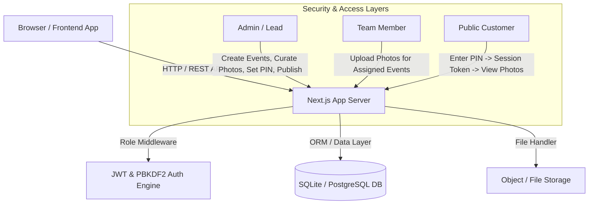

# Full Stack Photo Sharing Platform

**Candidate Submission for TrizenAI Technologies Full-Stack Internship Challenge**

A modern, scalable full-stack photo-sharing application built for event photography teams to upload, curate, and publish PIN-protected customer galleries.

---

## 🌟 Submission Quick Reference & Demo Credentials

> **Live Local Application URL**: `http://localhost:3000`  
> **Demo Customer Gallery URL**: `http://localhost:3000/gallery/abc123`  
> **Demo Gallery Access PIN**: `482917`

### Demo Credentials

| Role | Email | Password | Access & Permissions |
| :--- | :--- | :--- | :--- |
| **Admin / Lead** | `admin@trizen.com` | `Admin@123456` | Create events, assign team members, curate uploaded photos, publish galleries, set PINs. |
| **Team Member** | `photographer@trizen.com` | `Team@123456` | View assigned events, bulk upload photographs, view uploaded photos. |
| **Customer** | *(No Account Required)* | PIN: `482917` | Open share link, enter PIN, browse & download curated photographs. |

---

## 🛠️ Technology Stack

- **Framework**: [Next.js 14+ (App Router)](https://nextjs.org/) with TypeScript
- **Frontend UI**: React 18, Tailwind CSS, Lucide Icons, Lightbox Viewer, Responsive Layouts
- **Backend API**: Next.js Route Handlers (RESTful architecture)
- **Database & ORM**: Prisma ORM with dual-engine fallback (SQLite local storage / PostgreSQL cloud ready)
- **Authentication**: JWT HTTP-Only Cookies with Role-Based Access Control (`ADMIN` vs `TEAM_MEMBER`)
- **Password & PIN Security**: PBKDF2 with SHA-512 cryptographic salt hashing
- **Object Storage**: Pluggable storage adapter (`local` storage in `/public/uploads` + AWS S3 / Cloudinary cloud support)
- **Testing**: Automated NodeJS/Jest test runner for Auth, RBAC, PIN validation, and edge case verification

---

## 🏗️ System Architecture & Database Design



### Entity Relationship Diagram (Database Design)

- **User**: `id`, `name`, `email`, `passwordHash`, `role` (`ADMIN` | `TEAM_MEMBER`), `createdAt`
- **Event**: `id`, `name`, `description`, `eventDate`, `createdByAdminId`, `createdAt`
- **EventAssignment**: `id`, `eventId`, `userId`, `assignedAt`
- **Photo**: `id`, `eventId`, `uploadedById`, `filename`, `originalName`, `storageLocation`, `mimeType`, `fileSize`, `isSelected`, `createdAt`
- **Gallery**: `id`, `eventId`, `title`, `slug` (unique link identifier), `pinHash`, `isPublished`, `createdAt`
- **GalleryPhoto**: `id`, `galleryId`, `photoId`, `addedAt`

---

## 🔒 Security & Technical Requirements Handled

The application explicitly handles all required security edge cases:

1. **Attempting to access unassigned event (403)**: Team Members attempting to view or upload to unassigned events are blocked with `403 Forbidden`.
2. **Team Member attempting to publish gallery (403)**: Gallery creation and publishing APIs enforce strict `ADMIN` role checks.
3. **Incorrect gallery PIN (401)**: Customer gallery access returns `401 Unauthorized` on invalid PIN attempt.
4. **Attempted access to unpublished gallery (403/404)**: Direct URL access to draft/unpublished galleries is restricted.
5. **Failed photo upload handling**: Validates MIME types, file sizes, and returns structured errors.

---

## 🚀 Local Setup & Installation

### Prerequisites
- Node.js (v18.x or higher)
- npm or yarn

### Step 1: Clone & Install Dependencies
```bash
npm install
```

### Step 2: Initialize Database & Seed Demo Data
```bash
npm run db:init
```

### Step 3: Run Development Server
```bash
npm run dev
```
Open [http://localhost:3000](http://localhost:3000) in your browser.

---

## 🧪 Automated Testing

Run the automated test suite covering Auth, RBAC, Gallery Publishing, and PIN-protected verification:

```bash
npm test
```

### Test Coverage Highlights:
- ✅ Password hashing & verification with PBKDF2/SHA-512
- ✅ Role-Based Access Control (Admin vs Team Member permissions)
- ✅ Unassigned event access rejection (403)
- ✅ Team Member gallery publish restriction (403)
- ✅ Valid PIN gallery unlock (`482917` -> 200 OK)
- ✅ Invalid PIN rejection (`000000` -> 401 Unauthorized)
- ✅ Unpublished gallery protection (403)

---

## ☁️ Cloud Deployment Instructions

### Option 1: Docker Deployment
```bash
docker build -t trizen-photo-platform .
docker run -p 3000:3000 trizen-photo-platform
```

### Option 2: Vercel / Render Deployment
1. Connect this repository to Vercel or Render.
2. Set environment variables:
   - `JWT_SECRET`: `your-production-secret-key`
   - `NEXT_PUBLIC_APP_URL`: `https://your-app-domain.com`
3. Deploy! (Build command `npm run build` runs `db:init` automatically).

---

## 📝 Known Limitations & Future Enhancements

- **CDN Integration**: For large-scale production, cloud storage adapter can be connected to AWS CloudFront or Cloudinary CDN.
- **Bulk Zip Download**: Single-click multi-file download is enabled in the browser lightbox; server-side Zip archiving can be added for 10,000+ photo albums.

---
*Developed for TrizenAI Technologies Private Limited - Full Stack Internship Challenge.*
